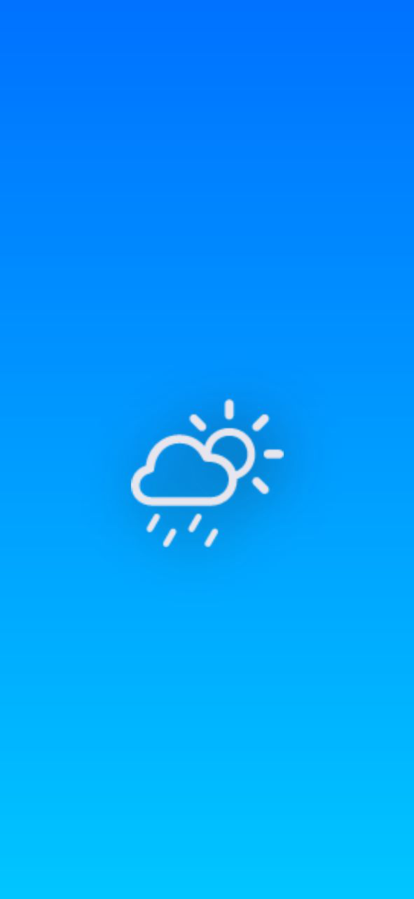
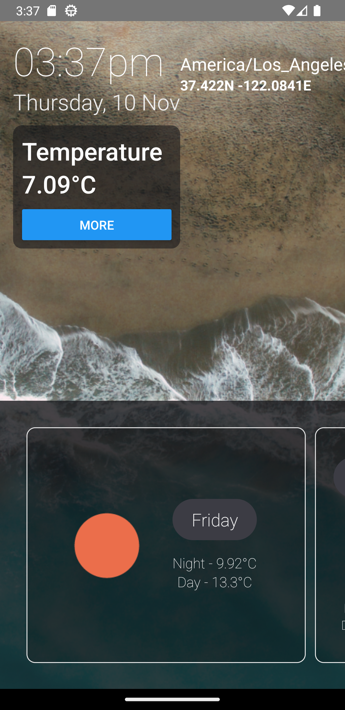
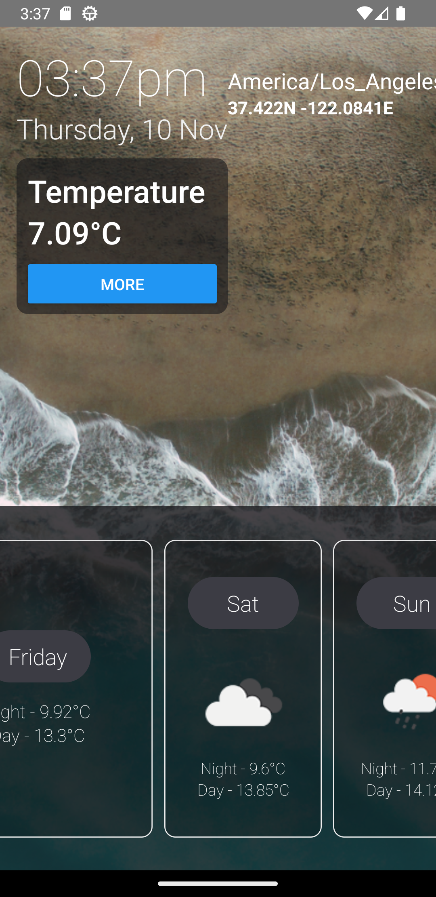
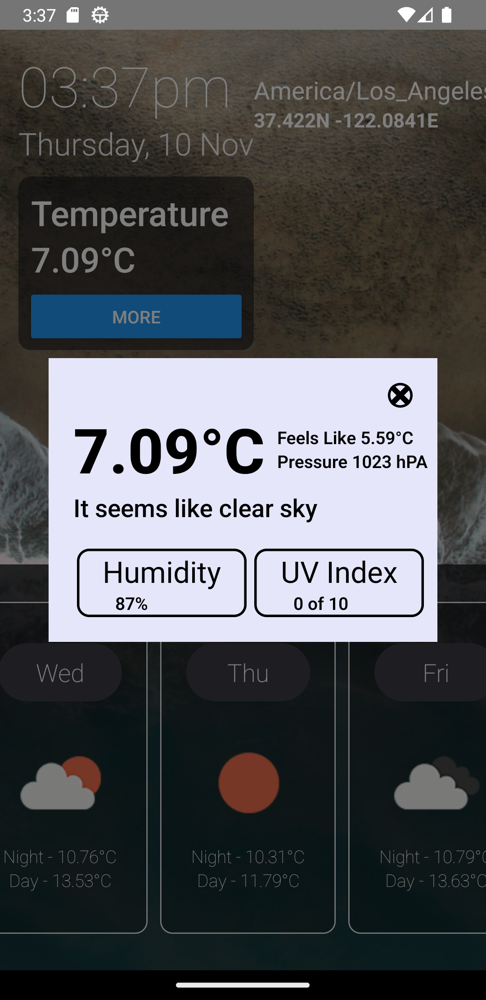

# Project Team No : 01

## Project Name: Weather App

**Team Members:**

1. Abdulrazak Patel
2. Anusha Lagidi
3. Chakradhar Reddy
4. Aniket Gaurav
5. Lagudu Chandana

**Command needed to run the project:**

- npm install
- npm i react-native-splash-screen
- npm install json-loader
- npm i moment-timezone
- npm install @react-native-community/geolocation

**Contribution to the Project:**

1. Abdulrazak Patel - Worked on Landing Screen of the app.
2. Anusha Lagidi - Worked on App Icon and SplashScreen for android.
3. Chakradhar Reddy - Worked on the Model screen for the app.
4. Aniket Gaurav - Worked on Desigining the app and SplashScreen for IOS.
5. Lagudu Chandana - Worked on API for Weather app.

Note :

1. Please Check the "assets/Output_Images" folder for Images of the APP.
2. This App is perfectly working in Android devices.

**Output Images of App:**

### App Icon

## Output Images

---

## 

---

## 

---

## 

---

## 

---
